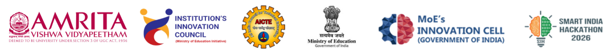

# Smart India Hackathon 2026 
#### Internal Hackathon @ Amrita Vishwa Vidyapeetham, Coimbatore Campus - Organized by Institution's Innovation Council (IIC)

<p align="Center">
  
</p>

## SIH26-A0H-TXXX
### Team Details
#### **Team Name:** VajraNet AI <br/>
#### Team Members
|         Role    |         👤 Name         |   🎓 Roll Number      |     ⚧️ Gender   |    🏫 Department / Programme   |
|:---------------:|:------------------------|:----------------------:|:---------------:|:-------------------------------:| 
|   Team Leader   | Punith J                |                        |      Male       | Computer Science & Engineering  |  
|    Member 2     |                         |                        |                 |                                 |  
|    Member 3     |                         |                        |                 |                                 |  
|    Member 4     |                         |                        |                 |                                 |   
|    Member 5     |                         |                        |                 |                                 |  
|    Member 6     |                         |                        |     Female      |                                 |   

#### Mentor Details

|     Type       |       Mentor Name   |       Designation     |          Department     |       Official Email ID  |
|:--------------:|:--------------------|:---------------------:|:-----------------------:|:------------------------ |
| Academic       |                     |                       |                         |                          |
| Industry       |                     |                       |                         |                          |

-----

### Problem Statement(s)

#### PS#1
* **Problem Statement ID:** SIH-2026-CYBER-01
* **Problem Statement Title:** Sovereign AI-Powered IPsec VPN Security Assessment Framework
* **Theme / Category:** Cybersecurity / Defence & National Critical Infrastructure
* **Ministry / Organization:** Ministry of Home Affairs / National Cyber Coordination Centre / CERT-In

---

# VajraNet AI
## *Sovereign AI-Powered IPsec VPN Security Assessment Framework*
> ### **“Verify the Tunnel. Protect the Mission.”**

Designed for Indian Government, Defence, Critical Infrastructure, and ABDM Healthcare Enclaves.

[](#)
[](#)
[](#)
[](#)

---

## ⚡ Executive Summary

**VajraNet AI** is an on-premises, evidence-aware cybersecurity assessment framework that analyzes authorized IPsec VPN packet captures, VPN gateway telemetry (via strongSwan VICI/`swanctl`), and organizational security policies to detect cryptographic risks, tunnel instability, metadata exposure, and compliance drift—**without decrypting sensitive patient, citizen, or defence payloads.**

---

## 🛡️ Core Innovations: The 3-Layer Truth Engine

VajraNet AI enforces strict evidence channel separation to eliminate guesswork:

1. **Gate 1 — Observed Data (PCAP Evidence):**
   - Direct packet header extraction (IKEv2 UDP/500, NAT-T UDP/4500, ESP Protocol 50, SPI values, sequence progression, timing intervals).
2. **Gate 2 — Verified Logs (Gateway Ground Truth):**
   - Kernel telemetry from strongSwan (`swanctl --list-sas`): AES-256-GCM cipher suite, Diffie-Hellman Perfect Forward Secrecy (PFS), anti-replay protection window, and Child SA lifetimes.
3. **Gate 3 — AI-Inferred Metadata (Explainable ML):**
   - Supervised Random Forest flow classifier (`macro F1: 0.94+`) operating purely on packet sizes, cadences, and burst signatures to classify traffic patterns and flag anomalous exfiltration bursts without inspecting encrypted payloads.

---

## 🌐 The National Sovereign IPsec VPN Triad

The framework actively monitors 12 tunnels structured across three vital national sectors:
- **🏛️ Government Sector (6 Tunnels, 74/100 Posture):** District offices to State Data Centres, Secretariats, and Public Distribution Grids.
- **🛡️ Defence Sector (3 Tunnels, 88/100 Posture):** Tactical Command Posts to Forward Airbases with anti-traffic analysis padding.
- **🏥 Healthcare Sector (3 Tunnels, 82/100 Posture):** Hospital headquarters to Diagnostic Labs and National Organ Registries.

---

## 🚀 Quickstart & Local Setup

### Option 1: Native Local Deployment (Frontend + Backend)

#### Prerequisites
- Node.js 18+ & npm 9+
- Python 3.10+

```bash
# 1. Start Backend FastAPI Server
cd backend
python3 -m venv .venv
source .venv/bin/activate
pip install -r requirements.txt
python seed_database.py
uvicorn app.main:app --host 127.0.0.1 --port 8000 --reload

# 2. In a separate terminal, start Frontend Vite Server
npm install
npm run dev -- --host 127.0.0.1 --port 5173
```

- Web Console: `http://localhost:5173`
- API Documentation: `http://localhost:8000/docs`

---

### Option 2: Docker Compose Deployment

```bash
docker-compose up --build -d
```

---

## 📂 Project Architecture

```
vajranet-ai/
├── backend/                           # FastAPI Sovereign REST Backend
│   ├── app/
│   │   ├── api/routes/                # Auth, Tunnels, Assessments, Findings, Policies, Reports
│   │   ├── core/                      # Config, Database, RBAC Security
│   │   ├── ml/                        # Dataset generator, Random Forest trainer, joblib model
│   │   ├── models/                    # SQLAlchemy database entities
│   │   ├── schemas/                   # Pydantic validation schemas
│   │   └── services/                  # Parsers, Risk Engine, ReportLab PDF Generator
│   ├── data/                          # Synthetic dataset, demo PCAPs, swanctl logs, YAML baselines
│   ├── seed_database.py               # Pre-seeder for 12 tunnels, 5 users, 5 policies
│   └── requirements.txt
├── docs/                              # Full Technical Documentation
│   ├── architecture.md                # 6-stage pipeline blueprint
│   ├── api.md                         # REST API specifications
│   ├── dataset.md                     # Feature taxonomy & ML metrics
│   ├── security-model.md              # RFC 4303 zero payload decryption guarantee
│   ├── deployment.md                  # Step-by-step on-premises deployment
│   └── demo-script.md                 # SIH 2026 5-act jury presentation walkthrough
├── public/assets/                     # Official insignia, triad nodes, pipeline graphics
├── src/                               # React 18 + Vite + TypeScript Console
│   ├── components/                    # Remediation widget, 3-layer card, modals, sidebar
│   ├── pages/                         # Overview, Tunnels, SA Timeline, Threat Matrix, Reports, etc.
│   └── services/api.ts                # REST API service with offline fallback
├── docker-compose.yml
└── README.md
```

---

## 🔒 Security & Privacy Notice
VajraNet AI is an authorized defensive cybersecurity assessment system. It complies with RFC 4303, CERT-In directions, and ABDM Security-by-Design guidelines. It does not perform payload decryption, packet injection, or private key exfiltration.
